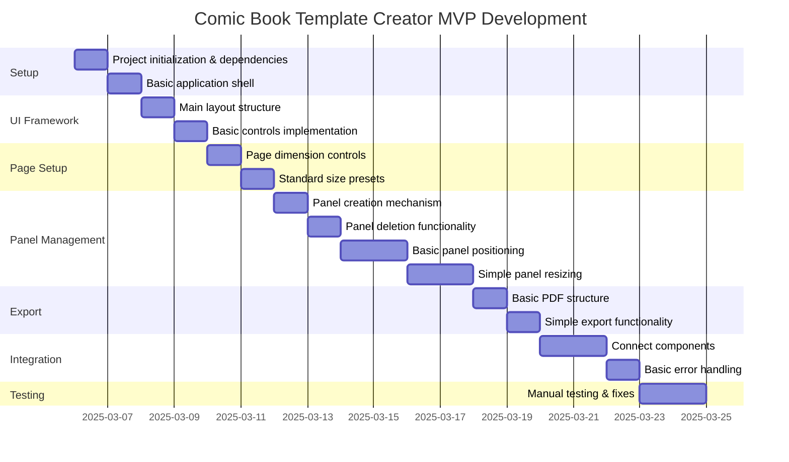

# Focused MVP Development Plan

Given your time constraint of about 1 hour/day, I'll outline a focused plan for the MVP that breaks down the work into manageable chunks. This plan prioritizes the core features needed for a functional MVP as defined in Phase 1 of your roadmap.

## MVP Core Features to Prioritize

1. **Basic Page Setup**
   - Standard comic book size presets
   - Custom page dimensions
   - Simple margin settings

2. **Simple Panel Management**
   - Add/delete panels
   - Basic panel positioning
   - Simple resizing functionality

3. **Standard PDF Export**
   - Basic export to PDF format
   - Simple page preview

4. **Core User Interface**
   - Minimal viable interface
   - Essential controls only

## Development Approach

Given your time constraints, I recommend:

1. **Incremental Development**: Focus on small, completable units of work
2. **Feature Slicing**: Implement minimal versions of features first, then enhance
3. **Regular Testing**: Test each component as it's developed

## Task Breakdown (1-hour sessions)

## Detailed 1-Hour Tasks

### Setup (2 sessions)
1. **Session 1**: Initialize project with Vite, install core dependencies (React, Electron, Zustand)
2. **Session 2**: Set up basic application shell and folder structure

### UI Framework (2 sessions)
3. **Session 3**: Create main application layout structure
4. **Session 4**: Implement basic controls and UI components

### Page Setup (2 sessions)
5. **Session 5**: Implement page dimension input controls
6. **Session 6**: Add standard comic book size presets

### Panel Management (6 sessions)
7. **Session 7**: Create basic panel addition mechanism
8. **Session 8**: Implement panel deletion functionality
9. **Session 9-10**: Develop basic panel positioning (drag & drop)
10. **Session 11-12**: Implement simple panel resizing

### Export (2 sessions)
11. **Session 13**: Set up basic PDF structure with pdf-lib
12. **Session 14**: Create simple export functionality

### Integration (3 sessions)
13. **Session 15-16**: Connect all components together
14. **Session 17**: Implement basic error handling

### Testing (2 sessions)
15. **Session 18-19**: Manual testing and bug fixes

## Development Recommendations

1. **Start with a static UI**: Begin with a non-functional UI to visualize the application
2. **Use mock data**: Create sample layouts to test functionality before connecting everything
3. **Leverage existing libraries**: Use Shadcn/UI components to speed up development
4. **Simplify where possible**: Focus on functionality over aesthetics for the MVP

## Next Steps

1. Set up the development environment
2. Create the basic application structure
3. Begin implementing the page setup features
